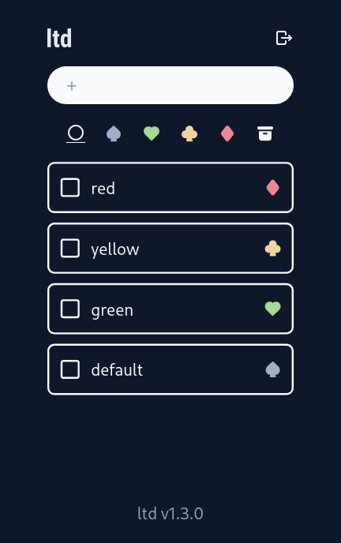

# ltd

Lightweight self-hostable to-do lists app with LDAP authentication.

[Demo page](ltd-cdd.pages.dev/)  
(No persistent data; Reload to reset the list.)



## features
- Store items as single JSON file for each `ou` in `items` directory, which is mounted to the Docker container.
- No tags, no categories. Just colored symbol. Click/tap the symbol on the right to change the color of the item. (`default -> green -> yellow -> red -> default`)
- Sortable. (Only in the left-most tab)
- Built-in LDAP authentication. Items are managed based on the `ou`: For instance, if your DN is `cn=user,ou=people,dc=example,dc=com` you can manage items in the `people.json`. However, you will not be able to view items in `users.json`, which can only be accessed by those with `ou=users`.

## deploy
1. Prepare empty `items` directory, and `.env` file with the following variables:

```
LTD_DOMAIN=yourdomain.com
LTD_SECRET_KEY=SECRET_STRING_TO_ENCODE_JWT
LTD_NETWORK=ldap://ldap:3890
LTD_API_TOKEN=SECRET_KEY_TO_POST_ITEM_VIA_API
```

2. 
`sudo docker run -d -v /path/to/items:/ltd/items --env-file /path/to/.env --network="ldap_docker_network_name_if_needed" --name ltd -p 8080:8080 kyoheiudev/ltd:1.4.2`

## API
To post an item via API, use HTTP `POST` request:

```http
POST /api/post
Content-Type: application/json
Authorization: LTD_API_TOKEN

{
  "value": "new item",
  "ou": "people"
}
```

## tech stack
- React
- axum
  - WebSocket
- protobuf
- ldap3
- JWT cookie

## develop
prerequisite: add test user to LDAP via LLDAP http server. See https://github.com/lldap/lldap .

```sh
make generate # generate types from .proto configuration
make dev
```