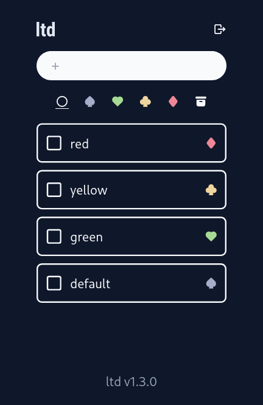

# ltd

Lightweight self-hostable to-do lists app with LDAP authentication.



## features
- Store items as single JSON file.
- Organize items by color: No tags, no categories. Just colors. Click/tap the dot on the right to change the color of the item. (`default -> green -> yellow -> red -> default`)
- Sortable. (Only in default color tab though)
- Built-in LDAP authentication. (No multiple user management yet for now)

## deploy
1. Prepare `.env` file:

```
LTD_DOMAIN=yourdomain.com
LTD_SECRET_KEY=SECRET_STRING_TO_ENCODE_JWT
LTD_NETWORK=lldap://lldap:3890
LTD_API_TOKEN=SECRET_KEY_TO_POST_ITEM_VIA_API
```

2. 
`touch /path/to/items.json && sudo docker run -d -v /path/to/items.json:/ltd/items.json --env-file /path/to/.env --network="lldap_docker_network" --name ltd -p 8080:8080 kyoheiudev/ltd:0.3.0`

## tech stack
- Svelte as the frontend
  - tailwindcss
- Rust as the backend
  - axum
  - ldap3
  - JWT cookie
